## f3
### 予想
- 0秒後にAが出力され、その後B,Cと表示される
### 結果：
- 0秒後にC、Aが出力された後にエラーがスローされる
### 理由：
- wait(0) が呼ばれる → Promise が生成される
- .then(logA) と .then(errX) がチェーンされる
- ここまでの処理は 同期的 → try 内でエラーはまだ起きていない
- try ブロック内の処理はエラーなしと判断され catch はスキップ→finallyのCが出力される
- 0ms 後に wait(0) が非同期処理として実行され、その後Aを出力
- その後のエラーはすでにcatchは終わっているのでcatchされない
```mermaid
gantt
  title f4
  dateFormat  s
  axisFormat |
    logC  :l1, 0, 0.2s
    logA  :l2, l1, 0.2s

```

## f4
### 予想
- 2秒後にAが出力され、1秒後にB、100と出力される
### 結果：
- 予想と同様
### 理由：
- wait2()でプロミスが2秒後に満たされるので次の.then()へ。
- Aを出力した後40を返す→プロミスが満たされるので次の.then()へ
- wait(1000)で1秒待った後次の.then()が呼び出される
- Bを出力し100を返す
- 最後の.then()は前の100を受け取り出力するので100が出力される

```mermaid
gantt
  title f4
  dateFormat  s
  axisFormat |
    wait2 :w2, 0, 2s
    logA  :l1, after w2, 0.2s
    wait1 :w1, after l1, 1s
    logB  :l2, after w1, 0.2s
    100   :l3, after l2, 0.2s
```



## f5
### 予想
- 2秒後にAが出力され、1秒後にB、100と出力される
### 結果：
- 2秒後にBが出力され、1秒後にA、40と出力される
### 理由：
- wait2()でプロミスが返され、二つ目のthen()が呼ばれ、コールバックを登録しようとする
- しかし二つ目のthen()はプロミスなので、wait2()の実行を待たずに実行される(wait2()と並列)→Bを出力し40を返す
- 三つ目の.then()には40が渡されるので40が出力される

```mermaid
gantt
  title f5
  dateFormat  s
  axisFormat |
    wait2 :w2, 0, 2s
    wait1 :w1, 0, 1s
    logB  :l2, after w1, 0.2s
    logA  :l1, after w2, 0.2s
    40   :l3, after l1, 0.2s
```

## f6
### 予想
- 1秒後にAが出力され、1秒後にBが出力され、1秒後にCが出力される
### 結果：
- 予想と同様
### 理由：
- 1つのPromiseに対してthenを2回呼び出すと、二回とも非同期で実行される
- よって、1つ目のthenの2秒待つタスクと2つ目の1秒待つタスクが同時に行われるので、結果として1秒ずつA,B,Cが出力される結果になる

```mermaid
gantt
  title f6
  dateFormat  s
  axisFormat |
    wait1 :w1, 0, 1s
    logA  :l1, after w1, 0.2s
    wait2 :w2, after l1, 2s
    wait1 :w1-1, after l1, 1s
    logB  :l2, after w1-1, 0.2s
    logC   :l3, after w2, 0.2s
```

## f7
### 予想
- 1秒後にAが出力され、2秒後にBが出力されすぐ後にCが出力される
### 結果：
- 1秒後にAが出力され、1秒後にBが出力されすぐ後にCが出力される
### 理由：
- 解決済みの Promise の then を呼び出すとどうなるか→すぐに実行される
- pとwait2は同時に実行される
  - pと wait2は同期的に実行されるので、pでwait1がスケジュールされた時点で次のwait2に行く 

```mermaid
gantt
  title f7
  dateFormat  s
  axisFormat |
    wait1 :w1, 0, 1s
    wait2 :w2, 0, 2s
    logA  :l1, after w1, 0.2s
    logB  :l2, after w2, 0.2s
    logC   :l3, after l2, 0.2s
```

## f8
### 予想
- 一秒後にXが出力され、すぐにAが出力される
### 結果：
- 予想と同様
### 理由：
- 一つ目の.then()でエラーがスローされ、.then-catchでエラーがcatchされる
- エラーログ(X)が出力されたのち、finallyでAが出力される

## f9
### 予想
- 1秒後にYが出力され、Aが出力される
### 結果：
- 予想と同様
### 理由：
- wait1()で一秒待った後、.then()が呼ばれる
- 呼ばれた後42が返され、プロミスが満たされるので.then()が呼び出される
- 次の.then()でエラーがスローされるのでcatchが呼ばれY化出力される
- 最後にAが出力される

```mermaid
gantt
  title f9
  dateFormat  s
  axisFormat |
    wait1 :w1, 0, 1s
    errY  :e1, after w1, 0.2s
    logA  :l2, after e1, 0.2s
```

## f10
### 予想
- 一秒後にエラーがスローされ、Yが出力されその後Aが出力される
### 結果：
- 一秒後にAが出力される
### 理由：
- .then(errY, (e) => log(e.message))は二つのコールバックがある
- .then(onFulfilled, onRejected)の形
- onFulfilled：前のプロミスが満たされたら呼ばれる
  - errYはthrow new Error("Y")するので、.then()自体のプロミスがrejectされる
- onRejected：前のPromiseが失敗したときに呼ばれる
  - .then()の第二引数は直前のPromiseが失敗したときだけ呼ばれる
  - なので呼ばれない。つまりYが出力されない
- then(r, c)：前のPromiseの拒否のみ捕捉
- .then(r).catch(c)：rの中で発生したthrowも捕捉

## f11
### 予想
- Xが出力される
### 結果：
- 予想と同様
### 理由：
- Promiseオブジェクトが呼ばれ、中身が実行される
- Promise内でエラーがスローされると自動的にReject状態になる
- プロミスがRejectされるとcatchが呼ばれ、Xが出力される

```mermaid
gantt
  title f4
  dateFormat  s
  axisFormat |
    Promise  :p1, 0, 0.2s
    error :e1, after p1, 0.2s
    catch  :c1, after e1, 0.2s
    errY   :e2, after c1, 0.2s
```

## f12
### 予想
- 何も出力されない(エラーがスローされるのみ)
### 結果：
- 予想と同様
### 理由：
- Promiseのコールバック関数でエラーがスローされてもcatchは呼ばれない
