## h1
### 予想
- 3秒後にAが出力され、2秒後にBが出力され、1秒後にCが出力される
### 結果：
- 予想と同様
### 理由：
- asyncと宣言すると、関数の戻り値はPromiseになる
- await キーワードはPromise を受け取り、戻り値やスローされた例外に変換する
- await wait3();でwait3();が完了するまで待つ（そのほかも同様）
- wait3();が完了したらlogAが出力される
- その後も同様

```mermaid
gantt
  title f4
  dateFormat  s
  axisFormat |
    wait3 :w1, 0, 3s
    logA  :l1, after w1, 0.2s
    wait2 :w2, after l1, 2s
    logB  :l2, after w2, 0.2s
    wait1 :w3, after l2, 1s
    logC  :l3, after w3, 0.2s
```

## h2
### 予想
- Xが表示される
### 結果：
- 予想と同様
### 理由：
- new Promise(...) が呼ばれる
- コンストラクタ引数の関数が即座に実行され、errX()を呼ぶので例外がスローされる
- Promiseは例外がスローされるとreject状態になるので、.catchが呼ばれる
- Xが出力される

## h3
### 予想
- 何も出力されない（エラーがcatchされない）
### 結果：
- 予想と同様
### 理由：
- new Promise(...) が呼ばれる
- コンストラクタ引数の関数は同期的に実行されるが、中がasyncの場合はPromiseを返す
- asyncが実行されたとき、errX()がスローされるが、あくまでasyncのPromiseがrejectになる。
- よってnew Promiseに伝わらないので、エラーがcatchされない

## h4
### 予想
- Xが出力される
### 結果：
- Yのエラーがスローされる（catchはされないのでYは出力されない）
### 理由：
- `const p1 = wait2().then(() => { errX(); });`, `const p2 = wait1().then(() => { errY(); });`が宣言されたとき、wait2(),wait1()が非同期に解決されるPromiseを返す
- .then() のコールバックは その Promise が解決された後に呼ばれる
- `await p1`と`await p2`が同時に開始される
- `p2`が先にRejectされるが、`p1`の結果を待っているのでスローされない
- `p1`が解決し、Xのエラーがスローされる
- Yは未解決エラーとして出力される（p2が先にrejectしたいが、p2を待っている関係で未処理のPromise拒否とみなされプロセスが落ちる）

```mermaid
gantt
  title f4
  dateFormat  s
  axisFormat |
    Promise1 :p1, 0, 0.1s
    Promise2  :p2, 0, 0.1s
    wait2 :w1, after p1, 2s
    wait1 :w2, after p2, 1s
    errX  :e1, after w1, 0.2s
```
