## i1
### 予想
- 1秒後に42が出力され、2秒後に42が再び出力される
### 結果：
- 1秒後に42が出力され、2秒後に100が再び出力される
### 理由：
- Promise.anyは、配列の中の非同期処理が一つでもresolveしたら処理を続行できる
- wait1().then(() => 42) → 約1秒後に成功して「42」を返すPromise
- Promise は 成功（resolve(42)）の時点でPromise.any は「最初に成功した値」として 42 を確定(v＝42)
- しかし一つ処理が成功したからと言って他の非同期処理がキャンセルされるわけではない(wait2はキャンセルされない)
- よって、バックグラウンドでv＝100が代入されるので二回目のコンソールは100が出力される
- .then(() => 0) は Promise チェーン上の返り値（＝0）を返すだけ

```mermaid
gantt
  title f4
  dateFormat  s
  axisFormat |
    wait1 :w1, 0, 1s
    P1解決(v=42) :p1, after w1, 0.1s
    log42  :l1, after p1, 0.2s
    wait2 :w2, after l1, 2s
    wait2 :w3, 0, 2s
    P2解決(v=100) :p2, after w3, 0.1s
    log100  :l2, after w2, 0.2s
```

## i2
### 予想
- 3秒後にA,B,Cが出力される
### 結果：
- 1秒後にC,2秒後にB,3秒後にCが出力され、最後に[ 'A', 'B', 'C' ]
### 理由：
- Promise.allは配列の全 Promise が完了するまで await で待つだけ
- 各 Promise の中で呼んでいる logX() は 即時実行される
- よって、1秒後にC,2秒後にB,3秒後にCが出力される
- すべてのPromiseが出そろったので、最後のlog(v)が出力される

```mermaid
gantt
  title f4
  dateFormat  s
  axisFormat |
    wait  3 :w1, 0, 3s
    logA  :l1, after w1, 0.2s
    wait2 :w2, 0, 2s
    logB  :l2, after w2, 0.2s
    wait1 :w3, 0, 1s
    logC  :l3, after w3, 0.2s
    log[A,B,C]  :l3, after l1, 0.2s
```

## i3
### 予想
- 1秒後にエラーのYが出力され(catchへ)、その後42が出力される。3秒後に再び42が出力される
### 結果：
- 1秒後にエラーのYが出力され(catchへ)、その後42が出力される。その1秒後Bが出力され、その2秒後に0が出力されるPromise.all はこの時点で 全体を reject とみなし catch に飛ぶ
### 理由：
- Promise.allは一つでも失敗したらRejectを返し、catchへ移行する
- よって、wait1が1秒でerrY() して rejectし、catch に飛ぶ
- しかし他の Promise はキャンセルされない → wait2, wait3 は並行でそのまま進む
- catch内のawait wait3() を待機し、その間に一つ目のwait3が終わりv = 0; errX() が実行される
- errX();はPromise.allがRejectされているのでcatch()に補足されない

```mermaid
gantt
  title f4
  dateFormat  s
  axisFormat |
    wait  3 :w1, 0, 3s
    wait2 :w2, 0, 2s
    logB  :l2, after w2, 0.2s
    wait1 :w3, 0, 1s
    errY(Promise.allはreject)  :p1, after w3, 0.2s
    (catch内)logY  :l3, after p1, 0.2s
    (catch内)wait3 :w4, after l3, 3s
    log0  :l4, after w4, 0.2s
```

## i4（書き換え前）
### 予想
- 5が出力される
### 結果：
- 予想と同様
### 理由：
- 非同期処理同士でvを共有しているため、それぞれで書き込んだ結果上書きされてしまう
- よって、Promise.allによる並列処理ではなく、awaitによる逐次処理にする→i4に実装
- しかし逐次処理は長いので、並列処理にして最後に足し合わせる方も実装→i4_2に実装