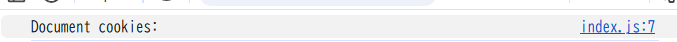

### index.js で`document.cookie` プロパティを `console.log`で表示する
- 何も表示されない
- 
- 理由：server.js(230行目)において、 HttpOnly を有効にしてクライアントの JavaScript から Cookie を参照できないようにされているため
### ブラウザの開発者コンソールで http://localhost:3000/ の Cookie を表示する
- 開発者コンソール⇒Application⇒Cookie
- res.setHeader()で設定したsidが存在している
### ToDo アプリのタブをリロードする
- リロード前に存在したToDoリストがそのまま反映される
    - チェックボックスの状態もそのまま保持されている
    - 初回リロード時に作られたCookieをブラウザがサーバーに送ることで同一のユーザーとしての認証が完了する
    - よって、保存されているデータを参照するのでリロードしても保持されたままになる
### 同一ブラウザの異なるタブやウィンドウで http://localhost:3000/ を開いて ToDo リストの状態を確認する
- 作成したTodoやチェックボックスの状態が保持されたまま
- 同一オリジン上にあるため、Cookieによって同じユーザーとして認証されるため、リロード時と同様に保持されたままになる
### シークレットウィンドウや異なるブラウザで http://localhost:3000/ を開いて ToDo リストの状態を確認する
### http://127.0.0.1:3000/ を開いて ToDo リストの状態を確認する
- オリジンが異なるため、新しくsidが発行される
- よって、これまで使っていたsidと異なるため、別人として認証される
- ToDoリストが初期化される
- 通常ブラウザ：`sid=9b50dd30-c250-41d7-86fb-a5b844a5bca0; SameSite=Lax; Path=/; HttpOnly`;
- シークレットウィンドウ：`sid=cb55f4ad-6f28-4852-85f8-b54df1996350; SameSite=Lax; Path=/; HttpOnly;`
`

### メモ
#### 前提条件：server.jsがやっていること
- index.jsからHTTPリクエストがあった際、server.jsでは以下が行われる
    - まず、main()が呼ばれ、その中でcookieAuthzMiddleware()で簡易的な認証が行われる
    - 以下コードのメモ
    ```js
    //リクエストについてきたCookieからsid(セッションID)を取り出す
    //なければ新しく作る⇒以降の処理で使えるようにする
    function cookieAuthzMiddleware(_url, req, res, params) {
        //リクエストにあるCookieヘッダを取り出す
        const cookieData = req.headers.cookie || "";
        //`;`でCookie分解する
        const fields = cookieData.split(";").map((data) => data.trim());

        // セッションに対して ID を付与し、セッション毎に Task API のデータを分離する
        const sidPrefix = "sid=";
        //sid=XXXから始まるものを探す
        const sidField = fields.find((data) => data.startsWith(sidPrefix));
        //sidField(↑で見つけたやつ)があればそれを使用する
        //なければランダムなIDを生成する
        const sid = sidField ? sidField.slice(sidPrefix.length) : crypto.randomUUID();
        console.log("session:", sid);
        //pramsに入れて後のAPIで使えるようにする
        params.__sid = sid;

        //サーバからの応答として、Cookieをレスポンスに付ける
        // HttpOnly を有効にしてクライアントの JavaScript から Cookie を参照できないようにする
        res.setHeader(
            "Set-Cookie",
            `sid=${encodeURIComponent(sid)}; SameSite=Lax; Path=/; HttpOnly;`,
        );
        return true;
    }       
    ```
