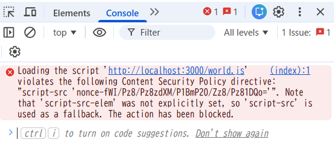

CSPの結果
- world.jsが読み込めなかったというエラーが出た
```
Loading the script 'http://localhost:3000/world.js' violates the following Content Security Policy directive: "script-src 'nonce-fWI/Pz8/Pz8zdXM/P1BmP20/Zz8/Pz81DQo='". Note that 'script-src-elem' was not explicitly set, so 'script-src' is used as a fallback. The action has been blocked.
```
