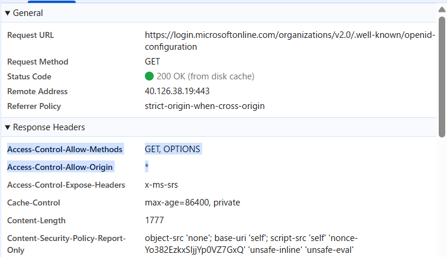
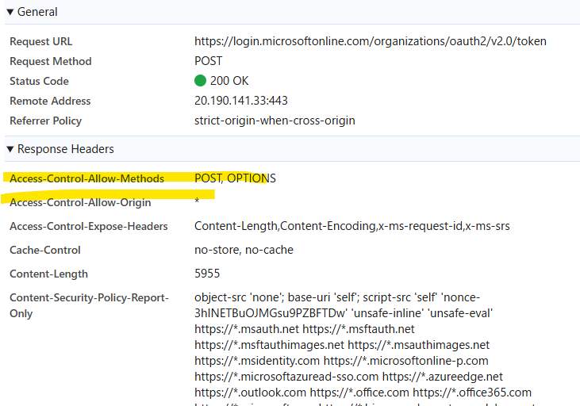

- 調べ方
    - Networkタブから`Fetch/XHR`を指定しリロードする
- SharePointのOneDriveで調べた
- ID(認可取得)はaccess-control-allow-methodsがGET, OPTIONS、access-control-allow-originが*出会った
- 
- 一方ログインのトークンを要求する場合は、Originは*、MethodsはPOSTが返ってきていた
- 
