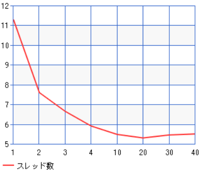

### マルチスレッドとは
- コンピュータープログラム内で、2つ以上のタスク(スレッド)が並列に実行される技術のこと
- スレッド：プロセス内の実行の単位。それぞれ以下を持つ
    - プログラムカウンタ
    - レジスタ
    - スタック
- メリット
    - UIを持つアプリではバックグラウンドでデータ処理をしつつ、UIの更新を同時に行うことが可能
    - パフォーマン向上
    - I/O操作
        - 一部のスレッドがI/O操作(読み書き)でブロックされていても他のスレッドは実行を続けることができる
- デメリット
    - 複数スレッドが共有データにアクセスすると、データの整合性が失われる可能性がある
        - 排他制御を用いてデータへのアクセスをコントロールする必要がある
        - 排他制御：一つのプロセスorスレッドだけがリソースにアクセスできるようにすること
    - スレッドの作成と管理にはコストがかかる
- マルチスレッドをサポートする言語
    - Java
    - C＋＋
    - python
- 参考： https://zenn.dev/goldsaya/articles/a728f0ce305e48
### mFib.js実行
- スレッド数20までは時間が短縮されていったが、それ以降は実行時間が伸びていった
    
- `mFib.js 45 1`
    - コンソール出力
        ```
        Worker 0 execution time: 11.307s
        Total execution time: 11.314s
        Fibonacci number: 1836311902
        ```
    - OS機能で確認したスレッド数：17
- `mFib.js 45 2`
    - コンソール出力
        ```
        Worker 1 execution time: 4.683s
        Worker 0 execution time: 7.594s
        Total execution time: 7.603s
        Fibonacci number: 1836311902
        ```
    - OS機能で確認したスレッド数：18
- `mFib.js 45 1`
    - コンソール出力
        ```
        Worker 0 execution time: 2.888s
        Worker 2 execution time: 4.289s
        Worker 1 execution time: 6.643s
        Total execution time: 6.649s
        Fibonacci number: 1836311902
        ```
    - OS機能で確認したスレッド数：19
- `node mFib.js 45 4`
    - コンソール出力
        ```
        Worker 2 execution time: 1.829s
        Worker 0 execution time: 2.557s
        Worker 1 execution time: 3.852s
        Worker 3 execution time: 5.899s
        Total execution time: 5.904s
        Fibonacci number: 1836311902
        ```
    - OS機能で確認したスレッド数：20

### PCのCPUスペックから適切なスレッド数について考察
- コア：10
- 論理プロセッサ数：12
- スレッド数は論理プロセッサ数とほぼ同じ意味なので、適切なスレッド数としては12が予想される
- しかし、実測値としてはスレッド数20の時が最も早かった
- 