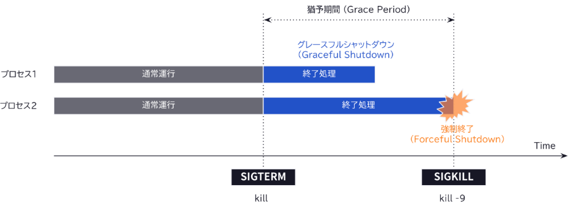
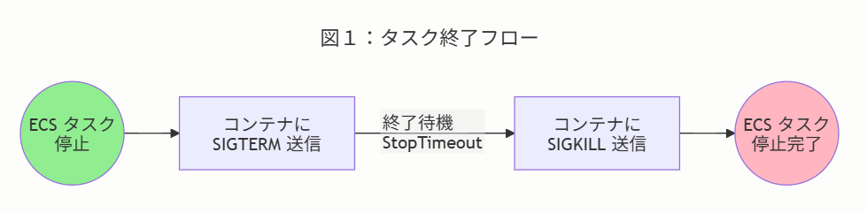

### グレースフルシャットダウンは
- 参考：https://zenn.dev/loglass/articles/348886ded0f0bd
- 端的に言うとプロセスを終了させるとき、可能な限り安全に完了させたりリソースの開放をしたりなど適切な終了処理をしてから終了すること
- ファイルを保存してからorアプリ内の状態保存を行うetc
- 対義語：Forceful Shutdown アプリが応答しなくなった時の強制終了

### シグナルの種類
- AWS ECS：https://aws.amazon.com/jp/blogs/news/graceful-shutdowns-with-ecs/
- SIGTERM：ECSタスク終了時に送られるシグナル
- SIGKILL：タイムアウトが経過した後送られるシグナル(デフォルトタイムアウトは30s)

- そのほか参考
    - https://zenn.dev/aqyuki/articles/94d398174aa9e7#graceful-shutdown