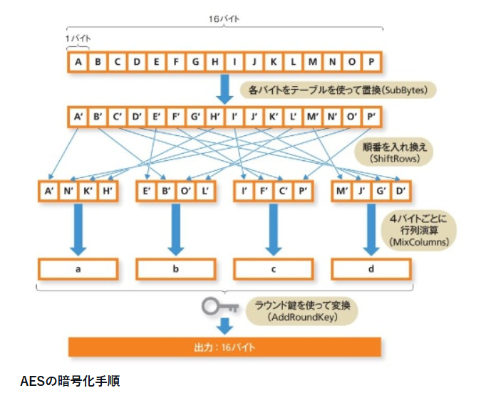
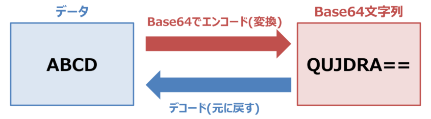
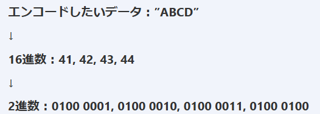
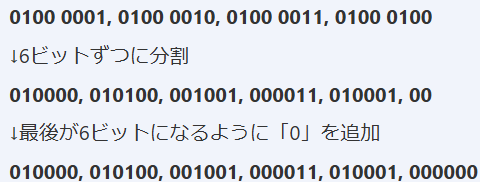
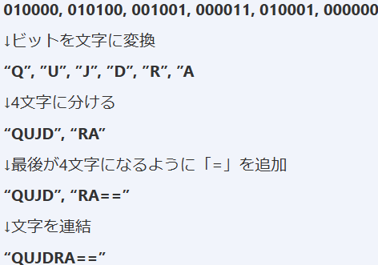

### AESとは
- 参考：https://www.saison-technology.com/column/glossary-short-096/
- 参考：https://xtech.nikkei.com/atcl/nxt/keyword/18/00002/030800119/
- 参考：https://www.netattest.com/aes-2023_mkt_tst
- 無線LANやSSL通信などに用いられる暗号化技術
- Advanced Encryption Standardの略
- 暗号化と復号化で共通のカギを使用する暗号方式で、共通鍵暗号方式の一つ(⇔公開鍵暗号方式)
    - メリット：鍵を共有できる関係であれば高速に暗号化できる
    - デメリット：鍵を安全に配る・保管する仕組みが弱いと破綻する
- AESの暗号の長さは128,192,256ビットの三種類ある
    - 一般に長ければ長いほど総当たり攻撃に強くなる
    - が、実運用では以下が採用されることが多い
    - AES-128：性能と強度のバランスがよく、一般用途で採用されることが多い
    - AES-256：より長期の機密性や規制・ポリシー要件（「256を要求」など）に合わせたい場合に選ばれる
- AESのプロセス
    - AESは128ビットのブロック単位で処理する
    - 128ビット＝16バイトを4×4の並びとして扱い、4種類の変換を繰り返す
        - SubBytes：各バイトをS-boxで置換し、非線形性を導入する
        - ShiftRows：行単位でバイトをずらし、位置関係を崩す
        - MixColumns：列単位で混合し、拡散を強める（※最終ラウンドでは省略される）
        - AddRoundKey：ラウンド鍵とXORし、鍵に依存した変化を加える
        - ざっくり下の図がわかりやすい
        
- AESはブロック暗号で、128ビットのまとまりを暗号化する(⇔ストリーム暗号：連続的に処理する)
- 利用例
    - 通信内容の暗号化に使われたり、VPNのトンネル内における暗号化に使われたりする
    - 無線LAN：WPA2で採用されている(が、暗号化だけでは不十分なので、認証方式や運用もセットで考える必要あり)
    - ファイル暗号化
    - 企業のストレージ暗号化
### Base64デコードとは
- 参考：https://it-infomation.com/base64/
- Base64：エンコード(データを他の方式に変換する)方式の一つ。以下64種類の文字を用いて変換する
    - アルファベット「a～z、A～Z」の52種類
    - 数字「0～9」の10種類
    - 記号「+, /」の2種類
    - 補足：データ長をそろえるために末尾に＝を使用しているので、厳密には65種類
    
- Base64デコードとは、この変換された文字列を元に戻すこと
- メールでよく使われる。なぜなら電子メールのプロトコルSMTPではASCII文字しか許されないから
- Base64は他にも
    - Basic認証
        - Basic認証はHTTPで定義されている認証方式の1つ
        - ーザー名とパスワードをコロンで結合した文字列(例: username:password)をBase64でエンコードした文字列をHTTPヘッダーに添付して送信する
    - ファイルアップロード
- エンコードの流れ
    - エンコードしたいデータを2進数に変換する
    
    - 変換した2進数を6ビットずつ分割。分割して6ビットに満たない場合は0を末尾に加える
    
    - ビットを文字に変換
    - その後4文字に分ける(4文字に満たなかったら＝を追加する)
    