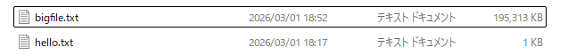

- 実行方法
    - サーバーを起動：`node index.js ./public 8000 `
    - 別ターミナルでテストファイルを作成：`echo "Hello upload test" > hello.txt`
    - `node index.js`を実行
    - publicディテクトリ直下にfoo/bar/hello.txtが作成される

- 大きなファイルを作成した場合
    - bigfile.txtを作成：ほぼファイルサイズと同じメモリ数が使われている
     
    - `fs.read` を利用した場合
     ```
     Before readFile
     Memory: 40.92 MB
     After readFile
     Memory: 232.70 MB
     ```
    - `fs.createReadStream` を利用した場合：ほとんど使用メモリは変わらず
     ```
     Before readFile
     Memory: 34.14 MB
     After readFile
     Memory: 35.41 MB
     ```