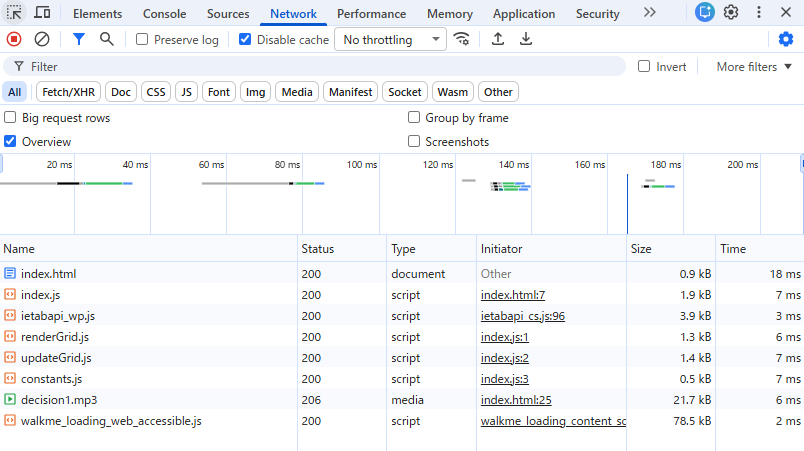
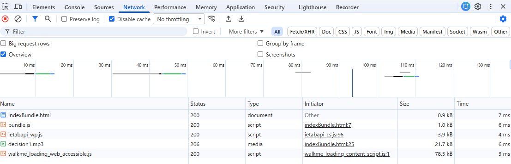

### バンドルしたコードと元のコードを比較し、どのような処理が行われたかを確認しなさい。
- 参考：https://qiita.com/sasao3/items/a0c16583c3acb6d7b4e1
- modeによって異なるが、今回はproductionモードでバンドルした
- コメントが消され、一行に圧縮される
- `(()=>{}`で包むことで即時関数になっている
- `use strict`が入って厳格モードの実行
- `addEventListener`や`cancelAnimationFrame`はそのままだが、他の関数名などは短縮化されている(頭文字をとっているわけでもなさそう？)
    - canvas → n、ctx → l
- サイズも3KB→2KBに圧縮

### バンドル前後それぞれのコードを利用するページをローカルサーバで配信してブラウザから閲覧できるようにしなさい。
- 参考：https://ics.media/entry/12140/
- `indexBundle.html`ファイルを作成
- `webpack-dev-server`をインストールし、webpackのサーバーを起動できるようにした
- package.jsonのscriptに`"start": "webpack serve --config webpack.config.js --open"`追加し、`npm run start`で起動できるようにした
-　バンドル前については従来通り

### 開発者ツールで `ネットワーク` タブを開き、スクリプトのダウンロード時間、ページの読み込み完了時間について比較しなさい。
- バンドル前
    - スクリプトのダウンロード時間：32ms(.jsが付くものを計算)
    - ページの読み込み完了時間：56ms
    
- バンドル後
    - スクリプトのダウンロード時間：13ms(.jsが付くものを計算)
        - スクリプトとしてはbundle.jsのみを読み込んでいる
    - ページの読み込み完了時間：26ms
    