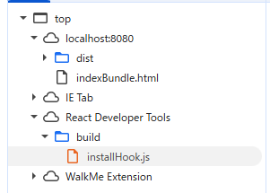
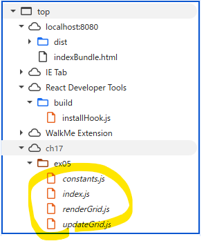
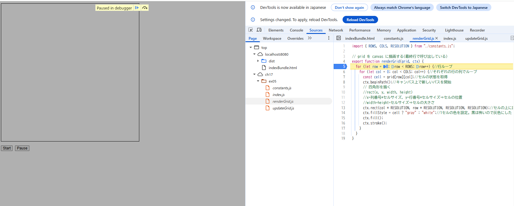

### webpack の設定でバンドル時にソースマップを生成するようにしなさい
- 参考：https://qiita.com/pegass85/items/4bd80828f95ef13d6159
- webpack.config.jsファイルに devtool: 'source-map',を記述することでソースマップを有効にする
- 新たにbuild.js.mapが作成される

### 開発者ツールで `ソース` タブ(Chrome, Edge, Safari) または `デバッガー` タブ(Firefox) を開き、ソースコードファイルがどのように表示されるかを確認しなさい。
- ソースマップ有効化したことで、ソースタブ内にファイルが見えるようになった
- ソースマップ生成有効化前
-  
- 有効化後
- 
### バンドルしたコードの実行中に、バンドル前のソースコードファイルに基づいたブレークポイントの設定や変数の値の確認等のデバッグが可能か確認しなさい。
- ブレークポイントの設定は可能
    - Sourceタブでブレークポイントを置きたいコードの行番号は右クリック
    - Add break pointで設定する
    - リロードするとその行で止まる(画像はGrid格子を描画する前で止まっている)
    
- 変数の値の確認も右タブのScopeで可能になっている。
- よって、バンドルしたコードの解析はデバックが難しいが、ソースタブを有効にすることで、ソースファイルを確認しながらデバックをすることが可能になっている