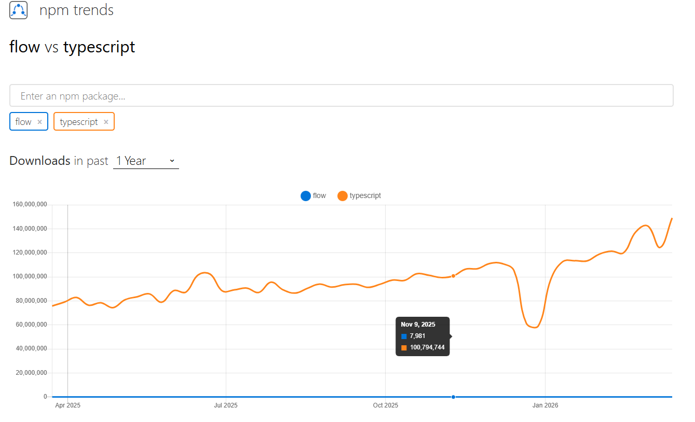

### TypeScriptとFlowについて、どちらが主流か、その理由
- 参考：https://zenn.dev/yunika/articles/8313960cfbc979
- 参考：https://npmtrends.com/@modern-js/utils-vs-typescript
- 参考：りあクト！Typescriptで始めるつらくないREACT開発(読書会より)
- 主流は圧倒的TypeScript
- npm trends見ると一目瞭然

- 理由としては以下
    - Flowが公開された当時は、強力な型推論型やNull安全性など、TSよりも優れている点があった
    - しかしあまりコミュニティとして発展していく雰囲気ではなかった
    - また、作られている言語がマイナーだったり、サードパーティーライブラリ向けの型が少ないなどあった
    - 一方TSは標準コンパイラや型チェッカーがTS自身で実装されていて、開発に参加しやすかった
    - よって、当初はFlowの方が優れていたが、TSに相次いで乗り換えることが多くなった(し、TSとしても成長していった)